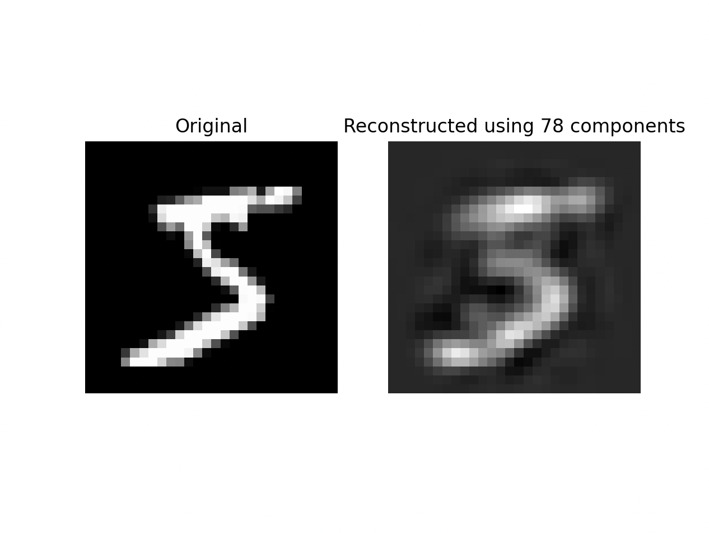

# PokèML Week 0 Assignments

**Name:** Om Godage
**Roll Number:** 21d100006

This repository contains the Python code for the Week 0 assignments for the PokèML course.

## Code Explanation

### `pca.py` (Code 1)

Generates two simple 2D datasets (linear and non-linear relationships) and applies PCA to find the principal component (direction of maximum variance). It then plots the data points and the principal component vector.

### `mnist.py` (Code 2)

Loads the MNIST dataset and applies PCA to reduce the dimensionality to 78 components. It then reconstructs the first image using these components and displays the original and reconstructed images side by side.

## Running Commands

1.  **Install Libraries:**
    ```bash
    pip install -r requirements.txt
    ```
2.  **Run Code 1:**
    ```bash
    python pca.py
    ```
    *(Replace `your_filename_for_code1.py` with your filename)*
3.  **Run Code 2:**
    ```bash
    python mnist.py
    ```

## Image Output (`pca_mnist.py`)
