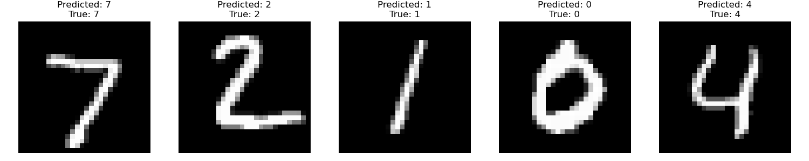
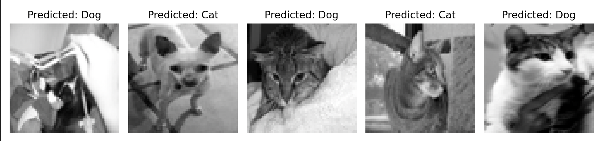

# PokèML Week 1 Assignments

**Name:** Om Godage
**Roll Number:** 21d100006

This repository contains the Python code for the Week 1 assignments for the PokèML course.

## Code Explanation

### Linear Regression (`task1`)
This code impelements a simple linear regression model using gradient descent. `smol.py` does linear regression for a synthetic dataset, while `big.py` does linear regression to predict the price of houses based on their features. The code produces three metrics: Mean Squared Error (MSE), R-squared, and Mean Absolute Error (MAE) for both datasets.

To run the code, use the following commands (from the root directory of the repository):
```bash
python -m task1.smol
python -m task1.big
```

### Logistic Regression (`task2`)
This code implements a logistic regression model using gradient descent. There are 4 sub-tasks:
1. **Simple Logistic Regression**: Logistic rergression on a separable dataset.
2. **Multiclass Logistic Regression**: Logistic regression on a dataset with multiple classes.
3. **Multilabel Logistic Regression**: Logistic regression on a dataset with multiple labels.
4. **Inseparable Logistic Regression**: Logistic regression on a dataset that is not easily separable.

To run the code, use the following commands (from the root directory of the repository):
```bash
python -m task2.st1
python -m task2.st2
python -m task2.st3
python -m task2.st4
```

### Applied Logistic Regression (`task3`)
This code applies logistic regression to the MNIST dataset, as well as cats vs dogs dataset.
To run the code, use the following commands (from the root directory of the repository):
```bash
python -m task3.mnist
python -m task3.cats_vs_dogs
```
### Image Output


